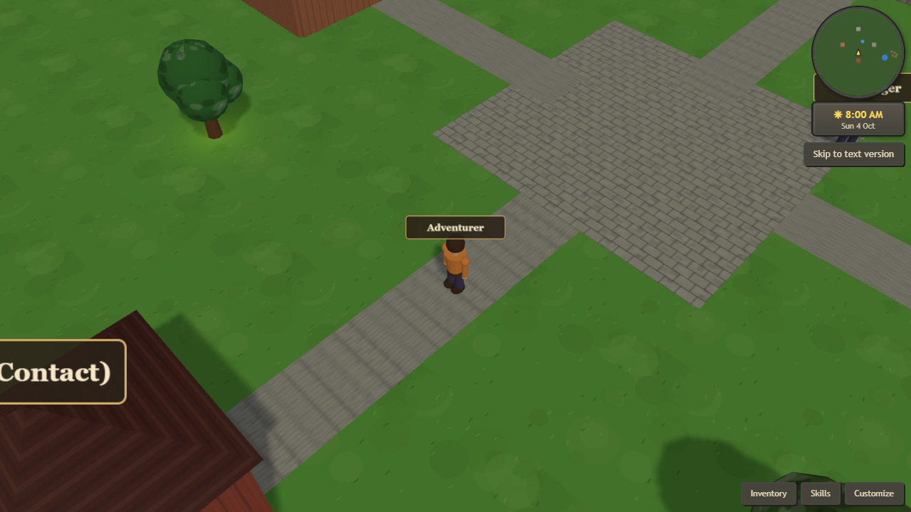
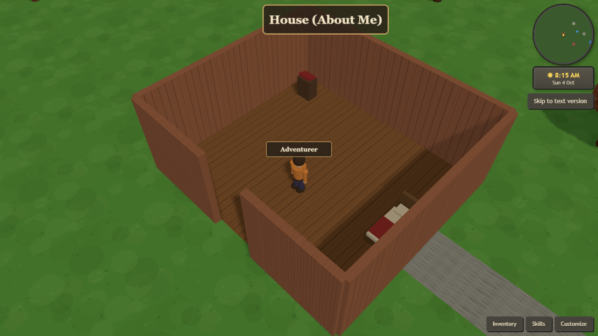
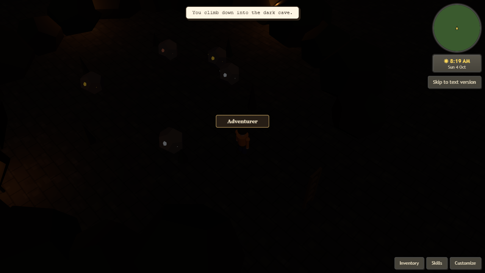

# The Village - Interactive Portfolio

An interactive, Old School RuneScape inspired portfolio. Instead of a static page,
visitors walk a small 3D village and step into its buildings to read my CV,
projects and skills. Chop trees, fish the pond, mine ore, cook over a fire and
explore an underground cave along the way.

Live at **[bradthedev.co.uk](https://bradthedev.co.uk)**.

[](https://github.com/Bradd101/portfolio-village/actions/workflows/ci.yml)



## Highlights

- **Fully 3D and hand built** with Three.js. No game engine, no external art: every
  model is assembled from primitives and every texture is painted procedurally to
  a canvas at runtime, so the whole site ships without image assets.
- **Playable world** with click to move, continuous woodcutting/fishing/mining,
  a day/night cycle, draggable camera, and a minimap.
- **Enterable buildings** whose roofs hide as you step inside, plus an underground
  cave with its own lighting.
- **Character customization** (name, colours, mix-and-match equipment) that persists
  across visits via `localStorage`.
- **Accessible by design**: a full plain-text version of all content for screen
  readers and no-JavaScript users, a skip link, and respect for the
  `prefers-reduced-motion` setting.
- **Real backends**: a hand-rolled PHP contact form (SMTP with correct dot-stuffing)
  and an AI "villager" chat proxied through PHP with a CORS allowlist and IP plus
  session rate limiting.

| Enterable house (roof hidden inside)                   | Underground cave                   |
| ------------------------------------------------------ | ---------------------------------- |
|  |  |

## Tech stack

- **Language:** TypeScript (strict)
- **3D:** Three.js
- **Build tooling:** Vite
- **Testing:** Vitest + jsdom
- **Quality:** ESLint (typescript-eslint) and Prettier, enforced in CI
- **Backends:** PHP (contact form SMTP, AI chat proxy)

## Getting started

```bash
npm install
npm run dev      # start the Vite dev server (http://localhost:5173)
```

Build and preview a production bundle:

```bash
npm run build
npm run preview
```

The PHP endpoints in `public/` (`contact.php`, `ask-villager.php`) run on any PHP
host; for local testing point a PHP server at the `public/` directory.

## Scripts

| Script                 | Description                                 |
| ---------------------- | ------------------------------------------- |
| `npm run dev`          | Start the Vite dev server with hot reload   |
| `npm run build`        | Type-check then build the production bundle |
| `npm run preview`      | Serve the built bundle locally              |
| `npm run typecheck`    | Type-check without emitting                 |
| `npm run lint`         | Lint with ESLint                            |
| `npm run format`       | Format the codebase with Prettier           |
| `npm run format:check` | Verify formatting (used in CI)              |
| `npm test`             | Run the Vitest unit tests                   |

## Architecture

The site is a single-page app. `src/main.ts` wires together a handful of focused
modules:

- **`src/three/village.ts`** - the world. Owns the Three.js scene, camera rig,
  lighting and day/night cycle, raycast interaction, the gathering state machine
  (woodcutting/fishing/mining), building interiors, the cave, and the player
  character. This is the one large, stateful module; the rest are small.
- **`src/game/`** - pure, framework-free game logic extracted so it can be unit
  tested in isolation: weighted loot rolls (`random.ts`) and circle-versus-box
  collision resolution (`collision.ts`).
- **`src/ui/`** - DOM UI that lives outside the canvas: the content panels, the
  side panel (inventory/skills/customize), the villager chat, toasts, the
  plain-text fallback site, and `localStorage` persistence.
- **`src/content.ts`** - all site copy (CV, projects, skills) in one editable file,
  kept separate from logic.
- **`public/*.php`** - the server endpoints.

Automated UI checks drive the running app through a small, localhost-only event
bridge (a `CustomEvent` on `document`), which lets a headless browser exercise
gameplay without pixel-perfect 3D clicks.

## Testing

Unit tests cover the pure game logic and the stateful UI pieces that don't need a
GPU:

```bash
npm test
```

CI (GitHub Actions) runs formatting, linting, type-checking, the test suite and a
production build on every push and pull request.

## Accessibility

- A complete plain-text version of every section (reachable via the "Skip to text
  version" link) for screen readers and when JavaScript is disabled.
- `prefers-reduced-motion` freezes the day/night cycle and stops decorative
  animation while leaving the site fully usable.
- Larger touch targets on coarse-pointer devices and a responsive layout for
  tablet and mobile.

## License

A personal portfolio project. The code is here to be read; please don't republish
it as your own.
